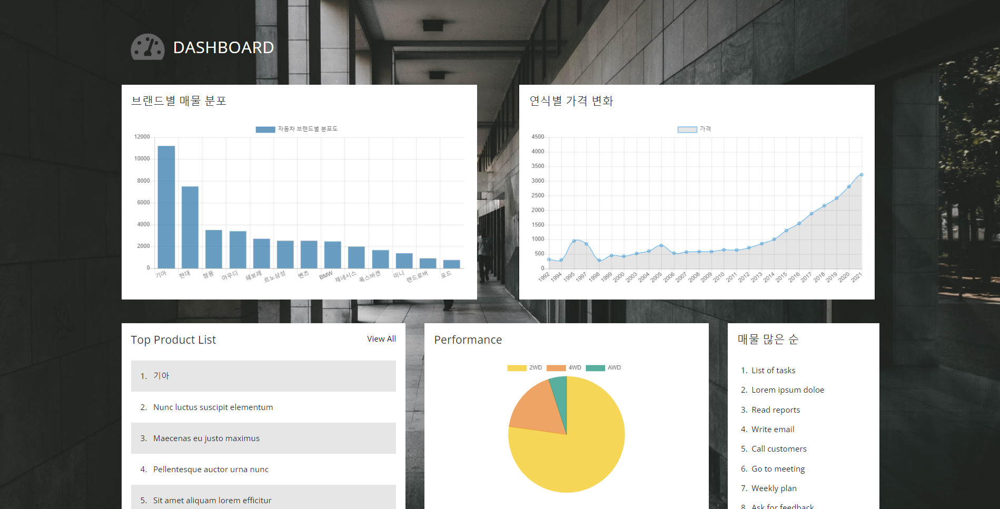
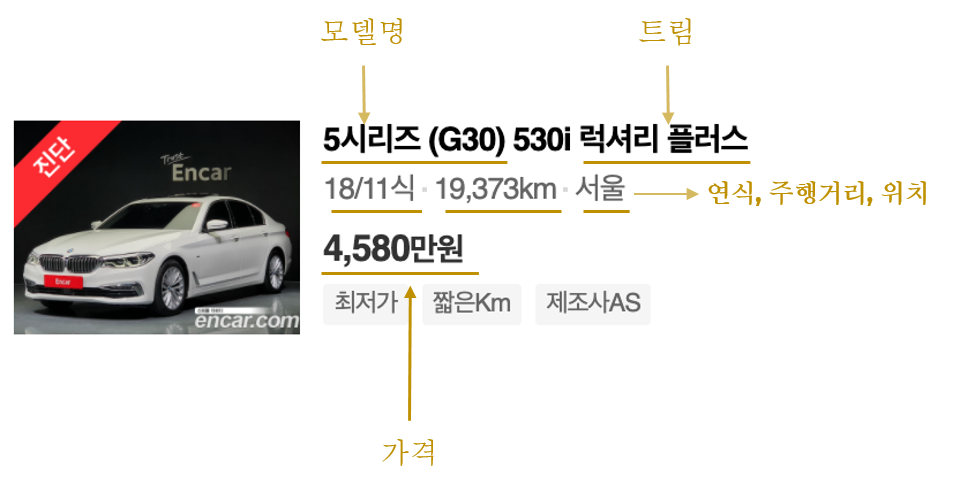
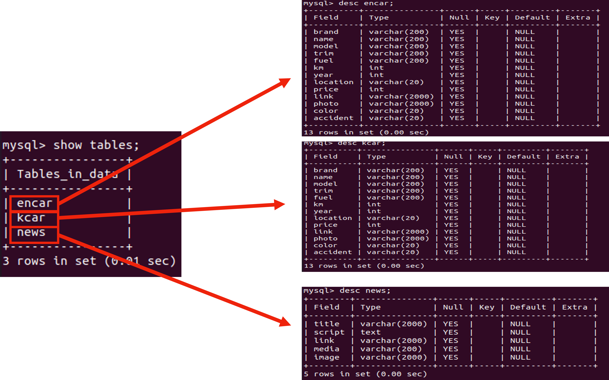
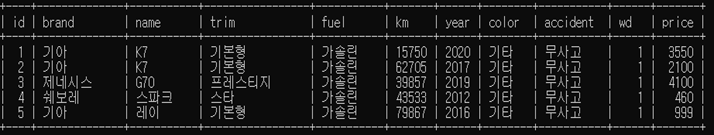
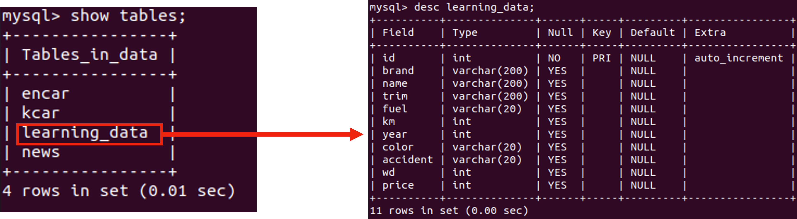
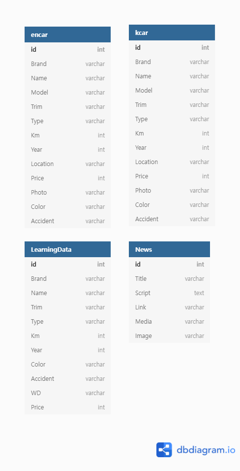

## Machine Learning 기반 중고차 가격 정보 제공 서비스 구축 프로젝트
---
## Description

Machine Learning과 Meta Search 기반의 중고차 가격 정보 제공 서비스 웹 페이지 구현

***
## ***Skill***

  

  
  

  
  

  

## ***Role***
---

- Encar,Kcar 사이트에서 중고차 데이터 크롤링
- Spark를 사용하여 원하는 형태로 데이터 전처리 및 가공
- Mysql에 Database 구축 및 설계
- Python과 Crontab을 사용하여 데이터 파이프라인 자동화
- Django 기반의 웹 페이지 구축
- AWS 개발환경 구축(hadoop,spark 등 설치)
- 웹 페이지 배포(Python Anywhere 사용)

<!-- 문구 수정 좀더 디테일하게 -->

# ***Outputs***

### **1. Django로 구현한 실제 웹 페이지**                   

##### 차량 가격 예측(판매) / 매물 정보 검색(구매) 페이지

<!-- 소소코드 링크 첨부하기 -->
    
[Page Link](http://52.78.91.136:8000) | [Source Code Link](https://github.com/ankiyong/day_car/tree/master/daycar)
    

### **2. 시각화**

  ##### 수집한 데이터로 시각화 진행

   [Dashboard Link](http://52.78.91.136:8000/cars)
       

    
    
    
### **3. 데이터 파이프라인**

**1. 수집**
  ##### BeautifulSoup을 사용하여 encar,kcar 사이트의 중고차 정보와 차량 관련 뉴스 데이터 크롤링
  
            
**2. 저장**
##### Raw데이터 DB구축(추후 매물정보 제공에 사용)
  
            

**3. 적재**

  ##### Hadoop에 Raw 데이터 csv파일 적재

<!-- hadoop 처리 로직이나 설정관련  -->

**4. 전처리**
  ##### Python에서 Spark session을 사용하여 Hadoop에 적재된 csv를 불러와 학습데이터로 가공

            

**5. 적재 및 저장**
  ##### 학습데이터 csv파일을 Hadoop에 적재 및 Mysql에 학습데이터 DB구축

            
            
**6. 최종 ERD**
  ##### 상단 2개 테이블은 컬럼명이 같지만 향후 업체별 검색기능 도입을 위해 테이블을 분리함

