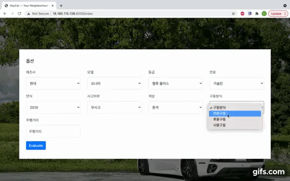

# Machine Learning 기반 서비스 구축 프로젝트
#### 1.Project

- 중고차 가격 정보 제공 서비스

#### 2. Description

- Machine Learning과 Meta Search 기반의 중고차 가격 정보 제공 서비스 웹 페이지 구현

#### 3. Role

- 중고차 데이터 크롤링
- 데이터 전처리
- DB구축
- 데이터 파이프라인 자동화
- 웹 페이지 구축
- AWS개발환경 구축
- 웹 페이지 배포

#### 4. Skill

        

​                                    

#### 5. Outputs

1. 차량 가격 예측(판매) / 매물 정보 검색(구매) 페이지

 

 [Dashboard](dashboard\index.html) 

